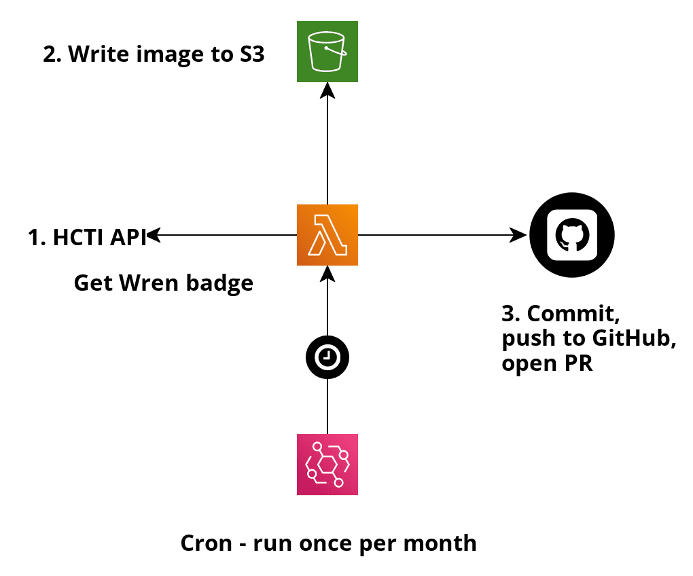
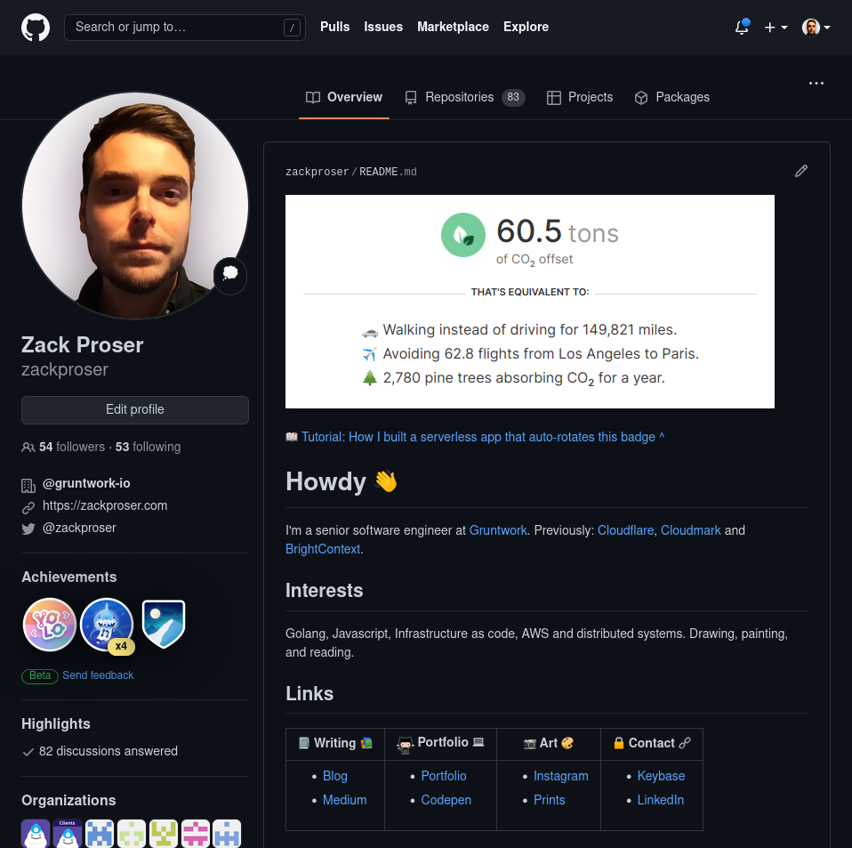

# Wren Badge Rotator

# Heads up!
This repository is the updated source code for [https://github.com/zackproser/wren-badge-rotator](https://github.com/zackproser/wren-badge-rotator), patched to work around a recent change to the Wren.co site structure that obviated the previous approach. 

This code has been simplified from the original tutorial's code: it needs only issue a request to the HTCI API to scrape the badge from a public Wren profile URL and write the image that is returned over top of the previous version the new badge. 

The HTML scraping and re-hosting hoops from the last iteration no longer need to be jumped through here. 

# Overview

[Read the article](https://levelup.gitconnected.com/hacking-iframe-badges-into-auto-updating-github-profile-images-with-aws-lambda-and-golang-d6fbf78d6f6d) that provides a deep dive of this repo and the problem it is solving. 

This is an AWS Lambda serverless function that is triggered by a CloudWatch event to run once per month. It updates my [Wren.co](https://www.wren.co/join/ZackProser?utm_campaign=share&utm_medium=profile_referral_link) badge on my Github profile with my latest stats 100% autonomously. 

Once a month, I review and merge the pull request it regularly opens for me. 

# Cloudformation

This app is defined via Cloudformation in `template.yml` which creates: 
* The AWS Lambda function that handles all the logic for: 
	* Sending [my Wren profile](https://www.wren.co/join/ZackProser?utm_campaign=share&utm_medium=profile_referral_link) page's URL to the HCTI API to extract the image found in the HTML page 
	* Writing the extracted updated badge image locally and pushing it to S3 for safekeeping / debugging
	* Cloning my Github profile repository, updating its badge, and programmatically opening a Pull Request  

# Pre-requisites 

[Install the AWS-SAM CLI](https://docs.aws.amazon.com/serverless-application-model/latest/developerguide/serverless-sam-cli-install.html), and export your credentials (`AWS_ACCESS_KEY_ID` and `AWS_SECRET_ACCESS_KEY`) to your shell via your preferred method. 

# Caveats - READ BEFORE ATTEMPTING TO DEPLOY 
1. *Permanent vs. Temporary credentials* Note that if you are using [`aws-vault`](https://github.com/99designs/aws-vault) to provide AWS authentication env vars to your commands, you must supply the `--no-session` flag, which will cause aws-vault to return your actual secret key, instead of the temporary access credentials you usually want. This is due to [a bug](https://github.com/99designs/aws-vault/issues/694) that causes temporary credentials to fail to create certain AWS resources. 
1. You must build your local project with `CGO_ENABLED=0 go build` - especially if you're running Linux - because otherwise both local sam invoke commands and the production AWS Lambda service will fail to find / run the golang binary. In addition, prior to running `sam package`, you must first ensure that the `.aws-sam/build/<FunctionName>/<go-binary>` has itself been built with `CGO_ENABLED=0`. Lately, this has meant manually copying it from `../../wren-badge-rotator` 

# Deployment 

`sam build && sam package --s3-bucket <your-sam-s3-bucket-name> sam deploy --guided`

# Configure your Lambda env variables in the Web Console

After successfully deploying the stack to AWS, you'll need to go into the Lambda function that was created and set the following environment variables: 

* `GITHUB_OAUTH_TOKEN`o- Your Github personal access token that has repo access scope
* `HCTI_API_USER_ID` - Your hcti.io User ID (create an account)
* `HCTI_API_KEY` - Your hcti.io API key 

Note that the `S3_BUCKET` and `WREN_USERNAME` env vars are also required by the Lambda function, but they are defined by the `template.yml`'s Lambda Environment property.

# N.B. 

If you wanted to use this yourself and run it - you'll need to make note of where I have environment variables defined (in the `template.yml` that are specific to my use-case). You'll want to update those to point at your own repo and your own Wren.co username
